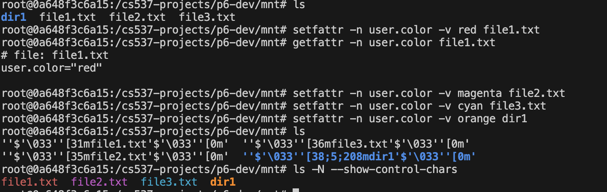

# Part 4 – Colour Colour which Colour do you choose? (xattrs + Colored ls)
---

## Objective
---
Welcome to the final part. Your goal is to add a per-file "color" tag. This is a two-part challenge:

- Store & Expose: You'll store this tag inside the inode and expose it to userspace using the standard "extended attribute" (xattr) interface.

- The Magic Trick: You'll make the ls command magically display filenames in their designated color, while all other programs (like cat, find, or shell scripts) see the normal, clean filenames.

## Key Concepts
---

### Extended Attributes (xattrs)

**The Idea:** An "extended attribute" is just metadata (key-value data) attached to a file that isn't part of its actual contents. We'll implement a custom attribute named `user.color`.

**Storage:** To store this, you'll need to add a new field (e.g., a `uint8_t` for the color code) to the `struct wfs_inode` itself.

**The Interface:** FUSE provides three callbacks to manage xattrs:

`setxattr`: Called by the user to write an attribute (e.g., setfattr -n user.color -v red \<filepath>).

`getxattr`: Called by the user to read an attribute (e.g., getfattr -n user.color \<filepath>).

`removexattr`: Called by the user to delete an attribute. Your job is to wire these callbacks to read and write your new `inode->color` field.

### The ls "Magic Trick" (Dynamic readdir)

**The Idea:** Your `wfs_readdir` function will behave differently based on who is asking. But how do you know who's calling?
`fuse_get_context()` gives you the caller's pid.
You can read the file `/proc/<pid>/comm` to get the caller's command name (e.g., "ls", "find", "bash").

**The Logic**: If command is "ls": You will build and send "decorated" filenames to the FUSE filler function. A decorated name is the real name wrapped in ANSI color codes (e.g., "\033[31mfile.txt\033[0m").

If command is anything else: You will send the normal, "clean" filename (e.g., "file.txt").

### The "Gotcha" (And the Fix)

**The Problem:** You just created a problem. When ls gets the decorated name \033[31mfile.txt\033[0m, it will immediately call wfs_getattr on that exact decorated path. Your `get_inode_from_path` function will fail because that path doesn't actually exist on disk.

**The Fix (Path Cleaning):** You need to "clean" all incoming paths.

**The Cleaner:** Implement the `strip_ansi_codes` helper function provided in wfs.c that all path-based operations (getattr, read, write) must go through.

## Implementation Guidance
---

Add to `wfs_inode:` Add your new color field to `struct wfs_inode` in wfs.h. Don't forget to initialize it to `WFS_COLOR_NONE` in mkfs.c and `fill_inode()`.

Implement xattr Callbacks: Implement the .setxattr, .getxattr, and .removexattr functions in wfs.c. Use the provided `parse_color_name` and `wfs_color_from_code` helpers. Use the `wfs_color_t` enum for different colors and don't modify this enum.

## Sanity Check
---

Use setfattr -n user.color -v red /mnt/somefile.

Use getfattr -n user.color /mnt/somefile and see it return "red".

Run ls /mnt. The file should be ANSI coded red.

Run ls -N --show-control-chars to see the file coloured red.

### Final Output:
